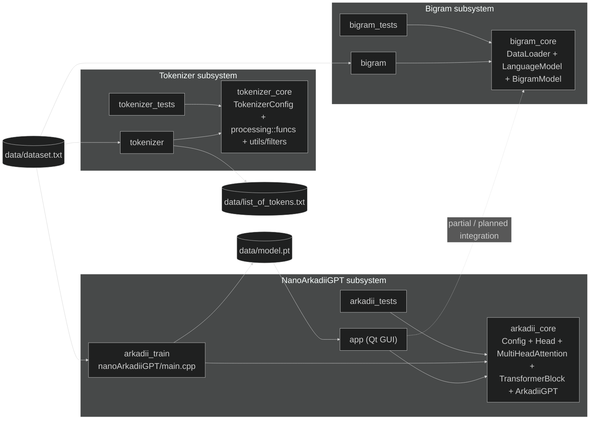
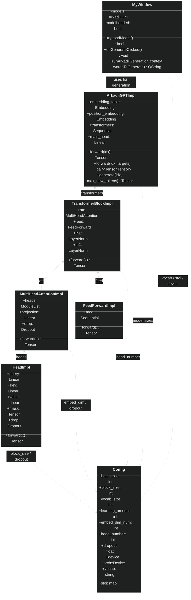

# HSE Mini GPT in C++

A university project that explores language modeling in modern C++, starting from simple token processing and a classical bigram baseline and moving toward a GPT-style transformer implemented with LibTorch and wrapped in a Qt desktop UI.

## Overview

This repository currently contains three mostly independent subsystems:

- `tokenizer`: a dataset preprocessing pipeline that extracts words, punctuation, and subword pieces and writes the final token list to `data/list_of_tokens.txt`
- `bigram`: a simple baseline language model built around `LanguageModel`, `BigramModel`, and `DataLoader`
- `nanoArkadiiGPT`: a LibTorch transformer stack with a Qt GUI application that loads a trained `data/model.pt` file and generates text

## Main architectural takeaways

1. The project is split into three mostly independent subsystems: a tokenizer pipeline, a classical bigram language model, and a neural GPT-like model built with LibTorch.
2. The neural stack is layered hierarchically as `Head -> MultiHeadAttention -> TransformerBlock -> ArkadiiGPT`, which keeps the transformer core modular and testable.
3. The application layer is separated from the model logic: the Qt GUI uses `arkadii_core` for inference, while token preparation, baseline modeling, and training experiments live in separate entry points.

## Architecture

### Module-level architecture



### `nanoArkadiiGPT` core UML



## Repository layout

```text
.
├── CMakeLists.txt
├── data/
│   ├── dataset.txt
│   ├── list_of_tokens.txt
│   └── model.pt
├── tokenizer/
│   ├── config/
│   ├── processing/
│   ├── utils/
│   └── tests/
├── bigram/
│   ├── dataloader/
│   ├── languagemodel/
│   └── bigrammodel/
└── nanoArkadiiGPT/
    ├── app/
    ├── ArkadiiGPT/
    ├── head/
    ├── multihead_attention/
    ├── transformerblock/
    └── tests/
```

## Build requirements

- CMake `3.24+`
- A C++23-compatible compiler
- [LibTorch](https://pytorch.org/cppdocs/)
- Qt6 Widgets for the GUI target
- GoogleTest is fetched automatically by CMake when tests are enabled

## Build

Configure:

```bash
cmake -S . -B build \
  -DCMAKE_PREFIX_PATH=/path/to/libtorch \
  -DBUILD_APP=ON \
  -DBUILD_TRAINER=ON \
  -DBUILD_BIGRAM=ON \
  -DBUILD_TOKENIZER=ON \
  -DENABLE_TESTS=ON
```

Build:

```bash
cmake --build build
```

You can disable optional parts if needed:

```bash
cmake -S . -B build \
  -DCMAKE_PREFIX_PATH=/path/to/libtorch \
  -DBUILD_APP=OFF \
  -DBUILD_TRAINER=ON \
  -DBUILD_BIGRAM=ON \
  -DBUILD_TOKENIZER=ON \
  -DENABLE_TESTS=OFF
```

## Main targets

- `app`: Qt GUI for text generation with `arkadii_core`
- `arkadii_train`: LibTorch training executable for ArkadiiGPT
- `tokenizer`: dataset preprocessing pipeline
- `bigram`: baseline word-level bigram generator
- `arkadii_tests`: unit tests for transformer modules and helper functions
- `tokenizer_tests`: unit tests for tokenizer logic
- `bigram_tests`: unit tests for bigram and dataset loading


## Runtime data flow

- `tokenizer` reads `data/dataset.txt` and writes `data/list_of_tokens.txt`
- `bigram` reads `data/dataset.txt` through `DataLoader` and generates text from the trained bigram statistics
- `arkadii_train` reads `data/dataset.txt`, saves checkpoints into `data/versions/`, and writes the final model to `data/model.pt`
- `app` looks for `data/model.pt` and loads it into `ArkadiiGPT` for inference

## ArkadiiGPT description:
- **10,788,929** parameters overall
- Embedding dimensions: **384**
- Amount of transformer blocks: **6**
- Amount of heads in multi-attention: **6**
- Training time: **~5 hours**

